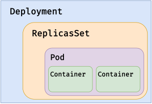

# Controllers

- ReplicaSet (stateless)
- Deployment
- StatefulSet (stateful)
- DaemonSet (1 / node)
- Jobs
- CronJob



```shell
# Apply deployment
kubectl apply -f 10-k8s-workload/manifests/deployment.yaml
# List
```

## Labels

Déclaration de labels
```yaml
labels: 
  app.kubernetes.io/part-of: caen-camp-stack
  app.kubernetes.io/component: api
  app.kubernetes.io/name: cc-api
  app.kubernetes.io/instance: cc-api-prod
  app.kubernetes.io/version: 1.0.0
```

Utilisation des labels
```yaml
# use labels as selectors
selector:
  app.kubernetes.io/name: cc-api-server
  app.kubernetes.io/instance: cc-api-server-prod
  app.kubernetes.io/version: 1.0.0
```

```shell
# get logs for all pods matching label
kubectl logs -l app.kubernetes.io/name=cc-api
```

## Resources

```yaml
resources:
  requests:
    memory: "64Mi"
    cpu: "100m"
  limits:
    memory: "128Mi"
    cpu: "200m"
```

## Probes

- Liveness
- Readiness
- Startup
```yaml
livenessProbe:
  timeoutSeconds: 1
  failureThreshold: 3
  initialDelaySeconds: 5
  periodSeconds: 5
  httpGet:
    path: /
    port: 3000
```


