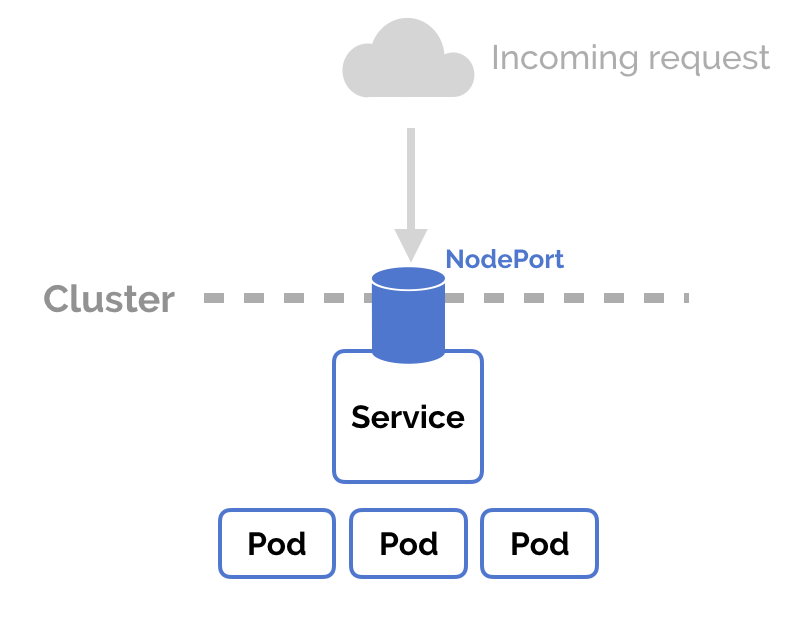
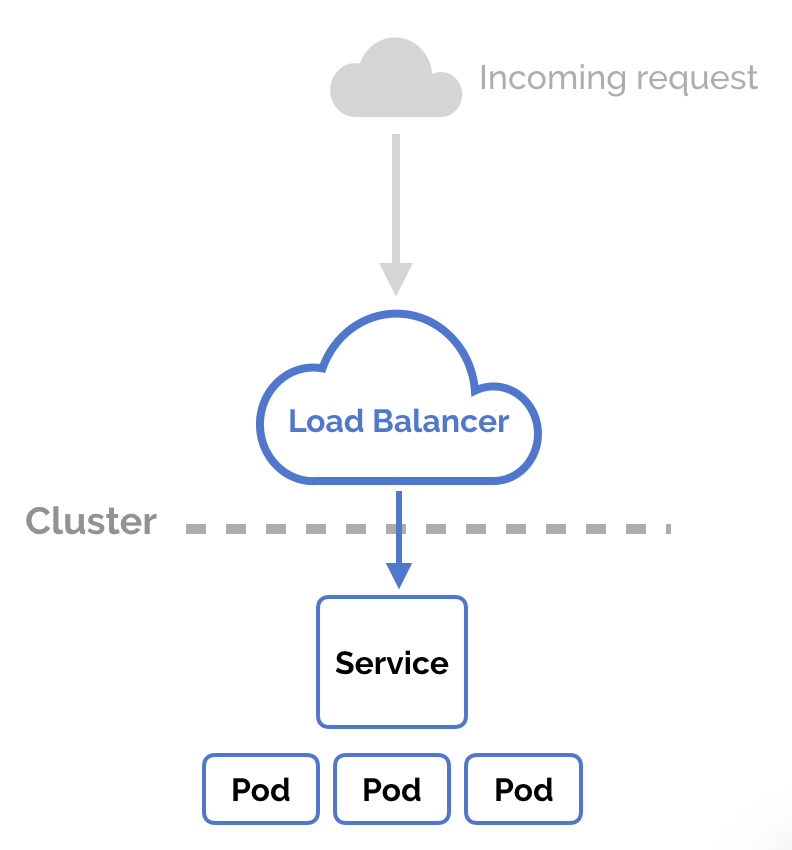

# Services

- ClusterIP
- NodePort
- LoadBalancer
- ExternalName

## NodePort

cf: https://matthewpalmer.net/

## NodePort

cf: https://matthewpalmer.net/

## Ingress

cf: https://matthewpalmer.net/# 
