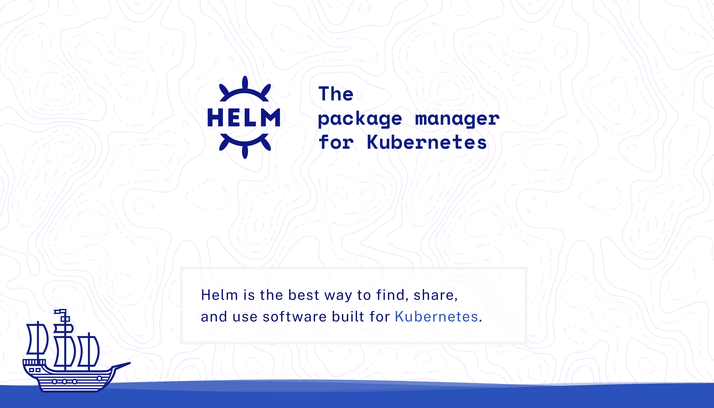

## Repository management

### Add repository

```shell
helm repo add stable https://charts.helm.sh/stable
```

### Update repositories

```shell
helm repo update
```

### Remove repository

```shell
helm repo remove stable
```

### Search chart
```shell
helm search repo ingress 
```

### Show chart versions
```shell
helm search repo [chart-name] --versions
```

## Values

### Show default values for a chart
```shell
helm show values ingress-nginx/ingress-nginx
```

### Show helm release values
```shell
helm get values ingress-nginx
```

### Render chart locally
```shell
helm template ingress-nginx ingress-nginx/ingress-nginx \
--version 4.0.17 \
--output-dir manifests
```

## Deploy nginx ingress controller

```shell
helm upgrade ingress-nginx ingress-nginx/ingress-nginx \
--install \
--namespace system-ingress-nginx \
--create-namespace \
--version 4.0.17    \
--set controller.service.loadBalancerIP="195.154.70.165"
```

## Deploy cert manager
```shell
# Add helm repository
helm repo add jetstack https://charts.jetstack.io
# Update helm repositories
helm repo update
# Install cert-manager
helm upgrade cert-manager jetstack/cert-manager \
  --install \
  --namespace system-cert-manager \
  --create-namespace \
  --version v1.7.1 \
  --set installCRDs=true
```


